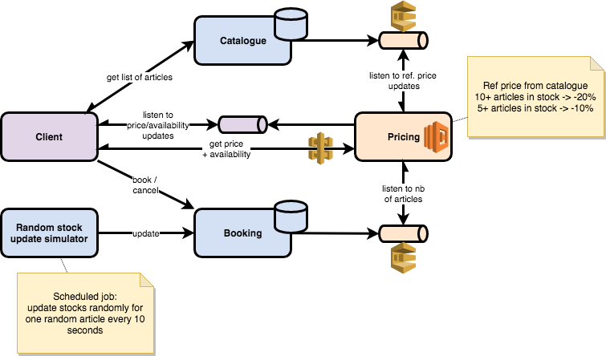

# micronaut-xke
This project is used as a support for an introduction to [Micronaut](https://micronaut.io).

## Prerequisites
### Install Micronaut CLI
* Homebrew (MacOS): `brew install micronaut`

### Configure IDE
1. IntelliJ: enable annotation processing
2. IntelliJ: delegate IDE build/run actions to gradle

## Run project
```shell
cd catalogue-service
./gradlew run
```
```
cd booking-service
./gradlew run
```
```
cd random-stock-update-simulator
./gradlew run
```

## Use case
The first goal is to define a set of microservices with 2 levels of depth as well as a test client.

* On startup, client fetches the list of articles from the _Catalogue_.
* On selection of an article, client calls _Pricing_ service to get the current availability and price of the article. Pricing service is made so that the price of an article depends on a reference price, defined in the Catalogue, and on the current number available in stock.
* Client can then book an article by calling the _Booking_ service, which possibly impacts availability of the article.
* _Random stock update simulator_ is a job that is in charge of simulating variations in the stock by calling the Booking service.

## Target architecture
Target architecture introduces several technical concepts:
* Asynchronicity, with the use of Reactive programming, Server-Sent Events and Queues.
* Serverless, with the introduction of a AWS Lambda function, along with GraalVM in order to minimize cold start time.
* Cloud computing, with the introduction of AWS SQS, AWS API Gateway and AWS Lambda.


## How to: create a module
```shell
mkdir booking-service
cd booking-service
mn create-app fr.xebia.xke.micronaut.booking.booking-service --inplace --features=management,hibernate-jpa
```
The list of available Micronaut features can be accessed: `mn profile-info base`

Some dependencies need to be added specifically in `build.gradle`:
* AssertJ: `testCompile "org.assertj:assertj-core:3.12.2"`
* Lombok: `annotationProcessor "org.projectlombok:lombok:1.18.8"`
* Lombok: `compileOnly "org.projectlombok:lombok:1.18.8"`
* Guava: `compile "com.google.guava:guava:28.0-jre"`
* Mockito: `testCompile "org.mockito:mockito-junit-jupiter:2.28.2"`
