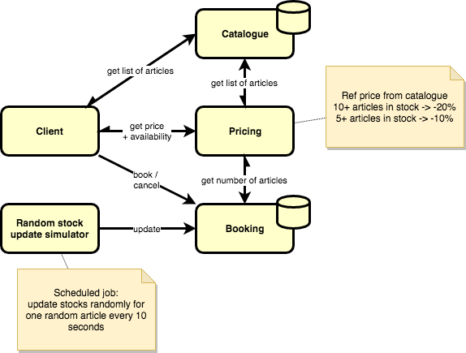

# micronaut-xke
This project is used as a support for an introduction to [Micronaut](https://micronaut.io).

## Use case
The first goal is to define a set of microservices with 2 levels of depth as well as a test client.

* On startup, client fetches the list of articles from the _Catalogue_.
* On selection of an article, client calls _Pricing_ service to get the current availability and price of the article. Pricing service is made so that the price of an article depends on a reference price, defined in the Catalogue, and on the current number available in stock.
* Client can then book an article by calling the _Booking_ service, which possibly impacts availability of the article.
* _Random stock update simulator_ is a job that is in charge of simulating variations in the stock by calling the Booking service.

## Target architecture
Target architecture introduces several technical concepts:
* Asynchronicity, with the use of Reactive programming, Server-Sent Events and Queues.
* Serverless, with the introduction of a AWS Lambda function, along with GraalVM in order to minimize cold start time.
* Cloud computing, with the introduction of AWS SQS, AWS API Gateway and AWS Lambda.

